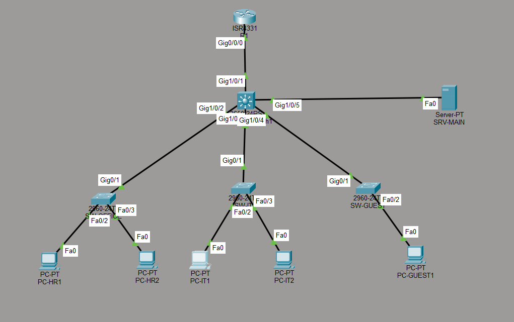

# Hybrid-NetOps-Cloud-Infrastructure-Lab

A self-directed, hands-on lab simulating an enterprise-grade
network environment — covering switching, routing, VLAN
segmentation, Linux server administration, cloud infrastructure,
and Python-based monitoring automation.

Built to mirror real-world NOC and network operations workflows.

---

## Lab Status

| Phase | Focus | Status |
|-------|-------|--------|
| Phase 1 | Enterprise Network Topology (Packet Tracer) | ✅ Complete |
| Phase 2 | Linux Server Administration (Ubuntu) | ✅ Complete |
| Phase 3 | AWS Cloud Infrastructure | ✅ Complete |
| Phase 4 | Python Network Monitoring Automation | ✅ Complete |

---

## Network Topology



---

## Network Design

### Device Inventory

| Device | Model | Role |
|--------|-------|------|
| R1 | Cisco 4331 | Inter-VLAN Router / Gateway |
| SW-CORE | Cisco 3650 | Core Distribution Switch |
| SW-OFFICE | Cisco 2960 | Access Switch — HR Department |
| SW-IT | Cisco 2960 | Access Switch — IT Department |
| SW-GUEST | Cisco 2960 | Access Switch — Guest Network |
| SRV-MAIN | Server | Central File / Web Server |
| PC-HR1 | PC | HR Department Endpoint |
| PC-HR2 | PC | HR Department Endpoint |
| PC-IT1 | PC | IT Department Endpoint |
| PC-IT2 | PC | IT Department Endpoint |
| PC-GUEST1 | PC | Guest Network Endpoint |

---

### VLAN Table

| VLAN ID | Name | Network | Purpose |
|---------|------|---------|---------|
| VLAN 10 | Office-HR | 192.168.10.0/24 | HR Department |
| VLAN 20 | IT-Dept | 192.168.20.0/24 | IT Department |
| VLAN 30 | Guest | 192.168.30.0/24 | Guest Network |
| VLAN 40 | Servers | 192.168.40.0/24 | Central Server |

---

### IP Addressing Table

| Device | VLAN | IP Address | Gateway |
|--------|------|------------|---------|
| R1 sub-int VLAN 10 | 10 | 192.168.10.1 | — |
| R1 sub-int VLAN 20 | 20 | 192.168.20.1 | — |
| R1 sub-int VLAN 30 | 30 | 192.168.30.1 | — |
| R1 sub-int VLAN 40 | 40 | 192.168.40.1 | — |
| PC-HR1 | 10 | 192.168.10.10 | 192.168.10.1 |
| PC-HR2 | 10 | 192.168.10.11 | 192.168.10.1 |
| PC-IT1 | 20 | 192.168.20.10 | 192.168.20.1 |
| PC-IT2 | 20 | 192.168.20.11 | 192.168.20.1 |
| PC-GUEST1 | 30 | 192.168.30.10 | 192.168.30.1 |
| SRV-MAIN | 40 | 192.168.40.10 | 192.168.40.1 |

---

### Port Configuration

| Device | Interface | Type | VLAN |
|--------|-----------|------|------|
| SW-CORE | Gi1/0/1 | Trunk | All |
| SW-CORE | Gi1/0/2 | Trunk | All |
| SW-CORE | Gi1/0/3 | Trunk | All |
| SW-CORE | Gi1/0/4 | Trunk | All |
| SW-OFFICE | Gi0/1 | Trunk | All |
| SW-OFFICE | Fa0/2 | Access | VLAN 10 |
| SW-OFFICE | Fa0/3 | Access | VLAN 10 |
| SW-IT | Gi0/1 | Trunk | All |
| SW-IT | Fa0/2 | Access | VLAN 20 |
| SW-IT | Fa0/3 | Access | VLAN 20 |
| SW-GUEST | Gi0/1 | Trunk | All |
| SW-GUEST | Fa0/2 | Access | VLAN 30 |

---

## Packet Flow Example

**Scenario: PC-HR1 pings PC-IT1 (cross-VLAN)**

```
PC-HR1 (192.168.10.10)
  → SW-OFFICE Fa0/2     [access port — adds VLAN 10 tag]
  → SW-OFFICE Gi0/1     [trunk — carries VLAN 10 tag]
  → SW-CORE Gi1/0/2     [trunk — carries VLAN 10 tag]
  → SW-CORE Gi1/0/1     [trunk — sends to router]
  → R1 Gi0/0/0.10       [reads destination IP — routes to VLAN 20]
  → SW-CORE Gi1/0/1     [trunk — carries VLAN 20 tag]
  → SW-CORE Gi1/0/3     [trunk — carries VLAN 20 tag]
  → SW-IT Gi0/1         [trunk — carries VLAN 20 tag]
  → SW-IT Fa0/2         [access port — strips VLAN 20 tag]
  → PC-IT1 (192.168.20.10)
```

---

## Repository Structure

```
Hybrid-NetOps-Cloud-Infrastructure-Lab/
│
├── configs/
│   ├── R1-config.txt          # Router running configuration
│   ├── Sw_Core-config.txt     # Core switch configuration
│   ├── Sw_Office-config.txt   # Office access switch configuration
│   ├── Sw_IT-config.txt       # IT access switch configuration
│   └── Sw_Guest-config.txt    # Guest access switch configuration
│
├── docs/
│   └── network-overview.txt   # Network design documentation
│
├── monitoring/
│   ├── noc_monitor.py         # Python NOC monitoring script
│   ├── noc_monitor.log        # Sample monitoring log output
│   └── Phase4_Python_Monitor.png  # Script output screenshot
│
├── topology/
│   ├── NOC_Lab_Enterprise.pkt          # Cisco Packet Tracer file
│   ├── NOC_Lab_Enterprise_Topology.png # Network diagram
│   ├── Phase2_Ubuntu_nginx.png         # Linux server screenshot
│   ├── Phase3_AWS_EC2.png              # AWS EC2 screenshot
│   └── Phase3_AWS_VPC.png             # AWS VPC screenshot
│
├── troubleshooting/
│   └── common-issues.txt      # Troubleshooting scenarios and fixes
│
└── README.md
```

---

## Phase Details

### Phase 1 — Enterprise Network Topology ✅

Built a multi-switch hierarchical enterprise network
in Cisco Packet Tracer:

- Hierarchical 3-tier design: Router → Core Switch → Access Switches
- 4 VLANs for department segmentation (HR, IT, Guest, Servers)
- Trunk links between all network devices using 802.1Q encapsulation
- Access ports on all end device connections
- Inter-VLAN routing via router sub-interfaces (Router-on-a-Stick)
- Central server (SRV-MAIN) accessible from all departments
- Full connectivity verified via cross-VLAN ping tests

**Device configs saved in:** `/configs`

---

### Phase 2 — Linux Server Administration ✅

Deployed Ubuntu Server 24.04 LTS in VirtualBox:

- CLI navigation and file system management
- Package management using apt
- nginx web server installation and configuration
- Service management using systemctl
- Incident report documentation via CLI

**Screenshot in:** `/topology/Phase2_Ubuntu_nginx.png`

---

### Phase 3 — AWS Cloud Infrastructure ✅

Deployed and explored cloud infrastructure on AWS Free Tier:

- EC2 instance provisioned (Amazon Linux 2023, t3.micro)
- VPC structure explored — subnets, route tables, internet gateway
- Security group rules reviewed (inbound/outbound traffic control)
- Billing alerts configured to prevent unexpected charges
- Instance stopped after exploration to remain within Free Tier

**Screenshots in:** `/topology/Phase3_AWS_EC2.png`
and `/topology/Phase3_AWS_VPC.png`

---

### Phase 4 — Python Network Monitoring ✅

Automated NOC-style monitoring script built in Python:

- Monitors 12 network targets (lab devices + internet)
- Pings each target and reports UP/DOWN status
- Logs timestamped results to noc_monitor.log
- Real internet targets (Google DNS, Cloudflare) confirmed UP
- Simulated lab IPs show DOWN (expected — Packet Tracer IPs
  are not reachable from Windows host)

**Script in:** `/monitoring/noc_monitor.py`

---

## Technologies Used

| Technology | Purpose |
|------------|---------|
| Cisco Packet Tracer | Network simulation and topology design |
| Cisco IOS CLI | Switch and router configuration |
| VirtualBox | Virtualization platform |
| Ubuntu Server 24.04 | Linux server operating system |
| AWS Free Tier | Cloud infrastructure (EC2, VPC) |
| Python 3 | Network monitoring automation |
| GitHub | Version control and portfolio |

---

## Key Features

- End-to-end packet flow analysis across VLANs
- Department-based VLAN segmentation with access control
- Hierarchical switching design mirroring enterprise architecture
- Cross-platform lab — simulation, virtualization, and cloud
- Automated NOC monitoring with timestamped logging
- Real-world troubleshooting documentation

---

## Troubleshooting Scenarios

Documented in `/troubleshooting/common-issues.txt`:

- VLAN misconfiguration — wrong access port VLAN assignment
- Trunk port failures — access mode set where trunk required
- ARP resolution delays — first ping packet loss explanation
- Inter-VLAN routing failures — missing sub-interface configuration
- Packet loss and latency debugging via ping and trace

---

## Learning Outcomes

- Hierarchical enterprise network design
- Layer 2 switching — VLANs, trunk/access ports, STP
- Layer 3 routing — inter-VLAN routing, sub-interfaces
- Linux server administration via CLI
- Cloud infrastructure fundamentals (AWS EC2, VPC)
- Python scripting for network automation
- NOC-style incident documentation and monitoring

---

## Certifications

| Certification | Status |
|---------------|--------|
| Cisco CCNA 200-301 | In Progress — Exam April 2026 |
| AWS Solutions Architect Associate | Planned 2026 |
| CompTIA Security+ | Planned 2026 |

---

## Future Improvements

- Add OSPF dynamic routing to Packet Tracer topology
- Configure DHCP pools on R1 for automatic IP assignment
- Add management VLAN (VLAN 99) for switch administration
- Expand Python script to send email alerts on DOWN status
- Integrate Zabbix or Nagios for real-time dashboard monitoring
- Add SNMP-based monitoring
- Enhance automation using REST APIs

---

## Author

**Kavan Patel**
HFC Plant Maintenance Technician → Aspiring NOC Analyst /
Network Systems Analyst

[GitHub](https://github.com/kavan-patel05) |
[LinkedIn](https://www.linkedin.com/in/kavanpatel18/)
